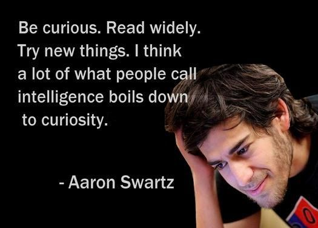

### Hi there 👋

I like to work on OpenSource Tools and Cool stuff on the Cloud! If you are like me? You'll find my updates on OpenSource tools quite useful!

Check out👇

* [AWS Notebook](https://histre.com/public/notebooks/dnllyanu/aws/) is the collection of tools I have used or browsed in my daily search 🕵️ could be useful if you work on AWS ☁️
* This notebook talks more about [Kubernetes](https://histre.com/public/notebooks/6uxdvo3y/kubernetes/), quite be overwhelming! 😅
* follow [#devopskhan](https://www.linkedin.com/feed/hashtag/devopskhan/) on LinkedIn & my [subreddit](https://www.reddit.com/r/devopskhan/) for more frequent content on OpenSource tools! ✨
* I occasionally share stuff on [Pocket](https://getpocket.com/@ej6g8d1dp2829A16a9Tf5d4T6bAMp3d8791rejDe86yem3bm4e14ex4fT4dluk29)!
* A quite noisy birdy on [twitter](https://twitter.com/Amaankhan4you) too! 😂

- 📫 **How to reach me** : [LinkedIn](https://www.linkedin.com/in/amaan-khan-linux-ninja) damn easy!
- 😄 **Pronouns** : He / Him 🤷‍♂️

  

My Last 7 days coding activity!

    

